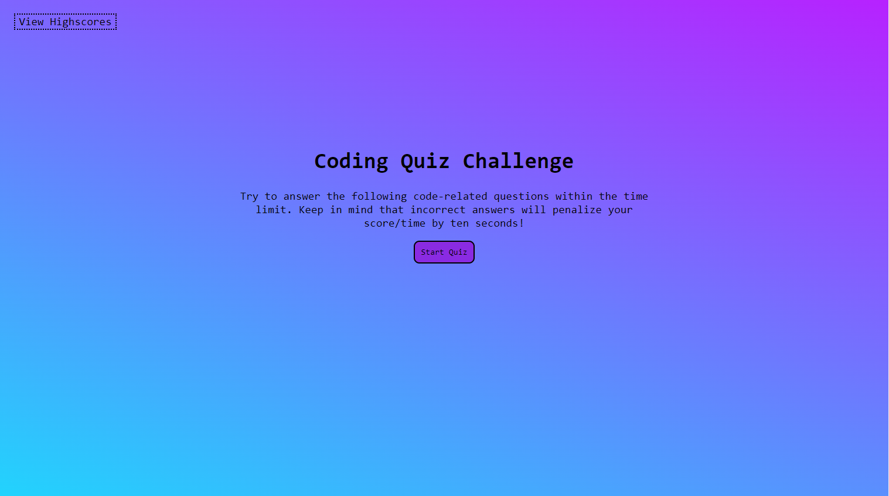

# Code-Quiz

### Description

Test your knowledge of basic HTML, CSS, and JavaScript by taking my multiple choice, time-sensitive quiz! Once you start the quiz, you have 75 seconds to complete the questions. Your score depends on how quickly you answer the questions, and a time penalty is issued when questions are answered incorrectly. Once you have completed the quiz, type your initials into the submission box and watch your score appear on the leaderboard via the HighScore page.

This project incorporates a variety of full-stack development techniques. HTML and CSS are utilized to structure and give aesthetics to the front-end of the web application, while JavaScript and web API's are used to alter the original HTML text, as well as collect and append user-collected data to the web page.

This project has been deployed using GitHub Pages. To access this project, follow this deployment link, or download the source files:
* [GitHub Repo](https://github.com/t-starkw/Code-Quiz)
* [Deployed Web Application](https://t-starkw.github.io/Code-Quiz/)

### Visuals

### Prerequisites

To install this application, you will need a text editor. I recommend VSCode.

### Installation

To install this code, download the zip file, or use GitHub's guidelines to clone the repository to your local device.

